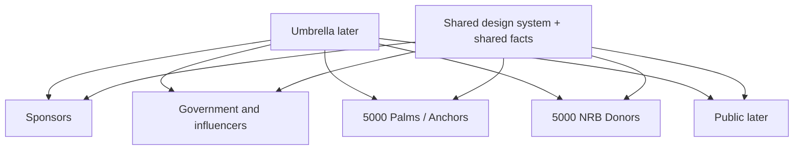

# Bharatiya Krishak Samaj Pujo — multi-audience architecture

> **Superseded for audience list and build order.** Use `BKS-DURGA-PUJA-2026-SIX-EXPERIENCE-DESIGN-SPEC.md`. Palms/Anchors is no longer a sixth site; Farmer / Integrated Farming is Experience 02. Priority is now Sponsor → Government → Farmer/IFS → NRB → Umbrella → Public. Current-state mapping in sections A–C below remains valid.

**Status:** SUPERSEDED as the active spec. **Not implemented. Not committed. Not deployed.**  
**Date:** 21 August 2026  
**Source of this brief:** earlier six-track draft (included Palms/Anchors).  
**Constraint:** preserve 20 August Mahacharya corrections. Do not destroy the current local site.

This document is architecture and messaging hierarchy. It does **not** invent final marketing copy, Palm Tech / 3C definitions, three-year programme details, government schemes, or a title sponsor.

---

## A. Current architecture

**What exists today**

| Layer | Fact |
|---|---|
| Product | Isolated static microsite in `site/` |
| Runtime | Single `index.html` + `app.js` + `campaign.js` + `offline-data.js` |
| Routing | Hash SPA: `#home`, `#puja`, `#ifs`, `#participate`, `#krishak`, plus homepage section hashes |
| Deploy shape | Repo-root `vercel.json` rewrites `/` → `/site/index.html`. `noindex`. |
| Languages | EN / BN / HI from JSON packs |
| Forms | Local JSON download. No payment gateway. |
| Isolation | Must not overwrite `bkswbengal.org` or other BKS production |

**Current routes / views**

Standalone views: Home, The Puja, Bharatiya Krishak Samaj, Integrated Farming, The Mission, Participate, Programme, Stories, Contact, plus utility (Accessibility, Sustainability, Sources, Locator stub).

Homepage sections currently include: story-bridge, story-arc, initiative (5,000 metrics), prep, about, sambhavana, nrb, ifs-tease, demo, model, fund, sponsor (bulk patronage), village, faq, then campaign blocks (theme, awards, record, nominate, visit, press, corporate sponsor enquiry).

Desktop nav (5): Home · The Puja · Integrated Farming · Participate · Bharatiya Krishak Samaj.

**What this product was designed as**

`DURGA-PUJA-PRODUCT-ARCHITECTURE.md` (14 Aug) recommended one seasonal campaign microsite that tries to hold culture, IFS knowledge, and participation in one child-of-BKS experience. That model is what the new brief replaces at the **communication** layer.

---

## B. Current audience mix

The live homepage currently addresses, in one scroll:

| Audience | Where they are spoken to now |
|---|---|
| General / festival visitor | Hero photo, The Puja, visit, programme, 2025 record |
| NRB donor / patron | Hero (current English H1), sambhavana, who-is-NRB, fund-a-farm, mission 5,000 |
| Corporate / festival sponsor | `#sponsor` bulk tiers + campaign sponsorship enquiry + Title / Category / Supporting packages |
| Farmer / nominee | Awards, nominate |
| Farmer operator (demo site) | Operator update form on the demo section |
| Curious public / IFS learner | `#ifs` “What is an Integrated Farming System?” |
| Press | Press facts block |
| Government / MLA / influencer | **Not a dedicated track** |
| 5,000 palms / anchors | **Not present in content** |

The 20 August pass made the **English hero NRB-first** (“Non-Resident Bengalis… agricultural resurgence”) while the commercial priority in this new brief is **sponsor-first**. Both sit on the same URL.

---

## C. Strategic conflicts

1. **One primary URL, many conversion jobs.** Participate, fund a farm, nominate, bulk patron, and sponsor enquiry compete after the same hero.
2. **NRB hero vs sponsor urgency.** The last PDF-aligned hero speaks to diaspora donors. The new brief says the sponsor experience must not be diluted by donor/community/government messaging.
3. **Sponsor and donor money-asks are mixed.** `#fund` (₹1 lakh NRB seed) and `#sponsor` (festival packages + farm clusters) live on the same homepage. A Palm Tech decision-maker and an NRB patron are not the same buyer.
4. **BKS reads as presenter / title, not organizing partner.** Press copy: “Presented by Bharatiya Krishak Samaj.” Header event name is correct; commercial title-sponsor slot is **not visually open**. `campaign.json` already sells a “Title Sponsor” package — which is fine as an *open commercial slot* — but visitor chrome does not say the title is vacant.
5. **KarmYog vs BKS role tension.** 20 August: Pujo **organised by** KarmYog for the 21st Century. New brief: BKS is **organizing partner**; title sponsor stays open. Three roles must be named, not collapsed.
6. **IFS page is a textbook, not a transformation story.** `#ifs` H1 is “What is an Integrated Farming System (IFS)?” — exactly the pattern the new brief forbids as a substitute for dump-yard → live farm.
7. **Demo farm is “being built” + empty feed**, not a time-based before/after story. Dump-yard / site-shift facts are **not in current JSON**.
8. **No palms/anchors track. No 294-MLA / institutional track.**
9. **Time horizon mismatch.** Current mobilisation copy is largely Puja 2026 → Puja 2027 (one year of farm seeding). New brief requires **Season 1 of a three-year movement**, without inventing the rest of the programme.
10. **“Rewrite most copy” (20 Aug) vs “do not serve everyone on one site” (now).** Improving one undifferentiated site cannot satisfy the new principle.

---

## D. Proposed multi-site architecture

**Recommended technical model (simplest that scales):**

> **One codebase, one design system, one static deployment, six audience experiences as path prefixes.**

Not six Vercel projects. Not six domains in this phase. Not a second “everything” homepage.

```text
site/                          shared CSS, JS, assets, header/footer primitives
  index.html                   PUBLIC (later) / interim current site — do not delete
  sponsors/index.html          Priority 1
  stakeholders/index.html      Government & Influencers
  anchors/index.html           5,000 Palms / Anchors
  nrb/index.html               5,000 NRB Donors
  (root later becomes umbrella OR public; see E and J)
```

Local `python -m http.server` continues to work. Vercel can later map optional subdomains onto the same folders. Each HTML shell loads shared styles/scripts and an **audience pack** of JSON. Shared facts live once.



### Experience 1 — Sponsor (P1)

- **Audience:** prospective sponsors, corporate decision-makers, Palm Tech sector, 3C sector, strategic partners.
- **Objective:** a signed key sponsor/partner commitment so first pieces can open.
- **Hero direction:** first-time sponsorship platform for Palm Tech + 3C; Durga Puja as the rare bridge between top decision-makers and the masses.
- **Primary CTA:** Express sponsor interest (reuse existing enquiry form; no payment).
- **Supporting CTA:** See the three-year platform / transformation (no invented stats).
- **Must not appear:** NRB ₹1 lakh adoption form, nominee form, MLA recruitment, generic “come to the pandal” as the lead, IFS textbook.
- **Relation:** Links out, once, to umbrella or public. Does not embed donor journeys.

### Experience 2 — Government & Influencers (P2)

- **Audience:** ~294 MLAs, government/institutional stakeholders, politicians, influencers.
- **Objective:** execution/impact narrative; institutional engagement, not sales.
- **Hero direction:** what is being built, and why the intervention matters.
- **Primary CTA:** Institutional / stakeholder connect (interest note — no invented scheme).
- **Supporting CTA:** Follow the live-farm transformation.
- **Must not appear:** sponsor packages, donor instalments, festival footfall sales copy.
- **Relation:** Transformation story shared as **fact + visuals**, not as a sales close.

### Experience 3 — 5,000 Palms / Anchors (P3)

- **Audience:** people recruited as anchors / “doing the palms”.
- **Objective:** explain the role and how to join.
- **Hero direction:** become one of the 5,000 anchors.
- **Primary CTA:** Join / register interest as an anchor.
- **Supporting CTA:** See what the role enables (farms / movement), without sponsor decks.
- **Must not appear:** Title Sponsor packages, NRB payment language.
- **Relation:** Distinct from NRB donors. **Definition of “palms” is an open question (N).**

### Experience 4 — 5,000 NRB Donors (P4)

- **Audience:** Non-Resident Bengalis (and the existing “beyond geography” definition already on file).
- **Objective:** mobilize 5,000 patrons to seed village farms.
- **Hero direction:** participate in Bengal’s larger resurgence from wherever you are — **not** the Palm Tech sponsor hero.
- **Primary CTA:** Adopt / register a farm (existing `#fund` form, relocated).
- **Supporting CTA:** Why the Puja is the entry; follow the transformation.
- **Must not appear:** corporate Title Sponsor sales, MLA narrative as the lead.
- **Relation:** Current English homepage hero and `#fund` / `#mission` are the seed content for this experience.

### Experience 5 — Umbrella (P5)

- **Audience:** anyone who arrives without a role.
- **Objective:** high-level “what is Bharatiya Krishak Samaj Pujo?” then **route**.
- **Hero direction:** one sentence of ecosystem context + “How would you like to participate?”
- **Primary CTA:** choose a path (Sponsor / Government / Anchor / NRB / Public).
- **Must not appear:** a second long homepage that retells every story.

### Experience 6 — Public (P6, later)

- **Audience:** janta / festival visitor.
- **Objective:** cultural Puja, visit, awards, 2025 record — without commercial dilution.
- **Basis:** the **existing site** after NRB/sponsor/gov slices are lifted out.
- **Do not prioritize now.**

**Shared narrative asset (not a seventh site):** dump-yard-like location → site shifted for access → becoming an integrated farm → people can follow it. Used on Sponsor, Government, NRB (and later Public) as **proof**, with audience-specific framing. Architecture: stages, dates, before/after slots, progress feed (the empty demo feed already exists).

---

## E. Priority

| Order | Experience | Build now? |
|---|---|---|
| 1 | **Sponsor** | Yes, after approval — first implementation |
| 2 | Government / Influencers | After sponsor skeleton exists |
| 3 | 5,000 Palms / Anchors | After “palms” is defined in approved copy |
| 4 | 5,000 NRB Donors | Lift from current homepage; do not invent a new hero until copy is approved |
| 5 | Umbrella | After two or more tracks exist so routing is real |
| 6 | General public | Later; current site remains the holding public surface |

Do not interpret this as a requirement to launch six URLs immediately.

**First experience to build:** Sponsor.

---

## F. Sponsor site map

Conversion path (from the brief):

**Understand opportunity → why this is different → three-year platform → audience / strategic value → transformation → express interest**

| Section | Job | CTA |
|---|---|---|
| Hero | First-time platform for Palm Tech + 3C (direction only until terms are approved) | Express interest |
| Why this is different | Puja connects decision-makers and masses in a way conferences cannot | Continue |
| Not just four days | Season 1 of a three-year movement — no extra programme claims | Continue |
| Audience / reach | Who the platform connects — **only approved facts** | Continue |
| Transformation | Dump-yard-like site → integrated farm (visual story slots) | Follow progress |
| The season | Continuing narrative over three years; sponsor from the beginning | Continue |
| Sponsor opportunity | Why enter now (launch window) — no invented pricing | Express interest |
| Organizing partner | Bharatiya Krishak Samaj as organizing partner; KarmYog per 20 Aug if still approved | — |
| Title sponsor | **Open / to be confirmed** — do not fill with BKS | Enquire |
| Sponsor interest | Existing enquiry form | Send enquiry / download |

**Existing approved material that can move here (not rewritten yet):** sponsorship enquiry form, indicative tiers *if still commercially valid*, 2025 Mahotsav as craft/credibility (not as “we already had this sponsor model”), awards as gathering proof.

**Do not auto-port:** NRB instalment calculator, sambhavana resurgence essay as the hero, “What is IFS?”, nominate-a-farmer.

---

## G. Government site map

| Section | Job | CTA |
|---|---|---|
| Hero | What is being built | Connect |
| Problem / opportunity | Why the intervention matters — no invented policy claims | Continue |
| Execution model | How the initiative is implemented (approved mechanics only) | Continue |
| Integrated farm vision | What is being created on the ground | Continue |
| Transformation story | Same visual asset, institutional framing | Follow the site |
| Scale | 5,000-farm vision **where already approved** | Continue |
| Stakeholder role | Why MLAs / government / institutions matter (~294 MLAs as *target group*, not as claimed partners) | Institutional connect |
| Connect | Interest / briefing request | Send note |

**Must not:** sponsor rate cards, donor CTAs, “buy a package”.

---

## H. Palms / Anchors site map

| Section | Job | CTA |
|---|---|---|
| Hero | Become one of the 5,000 anchors | Join |
| What is an anchor? | Plain definition — **blocked until copy exists** | Continue |
| Why participate | Human value | Continue |
| What you enable | Link to the larger initiative | Continue |
| How it works | Simple flow | Continue |
| Join | Register interest | Submit |

**Must not:** sponsorship packages.

---

## I. NRB donor site map

| Section | Job | CTA |
|---|---|---|
| Hero | Participate in Bengal’s larger resurgence from wherever you are | Adopt a farm |
| Why NRBs | Unique role (existing who-is-NRB copy is a candidate, pending Sambhavana corrections) | Continue |
| The Puja | Entry point, not a four-day souvenir | Continue |
| The farmer | Annadata / recognition | Continue |
| The transformation | Live farm they can follow | Continue |
| 5,000 donors | Collective mechanics already on file (one farm, one patron, ₹1 lakh / ₹20,000) | Continue |
| Contribute | Existing fund form | Register adoption |

**Must not:** copy the sponsor Palm Tech / 3C hero.

---

## J. Umbrella site map

```text
Bharatiya Krishak Samaj Pujo
  What is this?  (3–5 sentences, shared facts only)
  How would you like to participate?
    → Sponsors
    → Government / Institution
    → Anchor / Palm
    → NRB Donor
    → Public (later)
  Organizing partner: Bharatiya Krishak Samaj
  Organised with: KarmYog for the 21st Century  (if 20 Aug still stands)
  Title sponsor: Open
```

No second 3,000-word homepage.

**Until umbrella exists:** keep current `site/index.html` as the holding public URL. Add a **small, non-destructive** “For sponsors” entry only when the sponsor experience ships — do not replace the current home with an umbrella yet.

---

## K. Shared design system

Reuse from the current site (do not restyle for its own sake):

| Share | Do not blindly share |
|---|---|
| Tokens, typography, colours, buttons, cards, forms | Hero copy, primary CTA, nav items |
| Header **pairing pattern** (BKS seal + Pujo name \| KarmYog mark + organiser line) | Header implying BKS is commercial title sponsor |
| Language control + accessible dropdown | Same H1 in every language pack without native review |
| Footer, crumbs, skip link, focus, reduced-motion | IFS textbook as the transformation module |
| Assets: seal, KarmYog crop, 2025 idol (with credit), 2026 prep photo | Duplicate festival photos as filler |
| Form download behaviour | Payment (still none) |
| Shared facts JSON: dates 16–20 Oct 2026, Kolkata, org registration, leadership names already on file, 5,000 / ₹1 lakh **as mobilisation goal**, demo location East Kolkata Wetlands 500 m from Sector V | Audience propositions |

**Header rule for all experiences**

- Event name: Bharatiya Krishak Samaj Pujo  
- Organizing partner: Bharatiya Krishak Samaj  
- Organised by / with: KarmYog for the 21st Century (preserve 20 Aug unless product owner revises)  
- Title sponsor: Open / to be confirmed — never occupied by BKS  

Nav is **audience-specific**. Breadcrumbs: `Pujo / Sponsors / …` etc.

---

## L. Content that must remain separate

Never copy these across audiences:

| Must stay separate | Why |
|---|---|
| Hero proposition | Core reason for multi-site |
| Primary CTA | Sponsor enquire ≠ NRB adopt ≠ anchor join ≠ MLA connect |
| Proof | Footfall/decision-maker bridge vs execution vs human role vs diaspora belonging |
| Money language | Corporate sponsorship vs ₹1 lakh seed vs no-money public visit |
| “Title Sponsor” packages | Sponsor track only; never on Palms or Government |
| Palms/anchor recruitment | Not a sponsor sales slide |
| 294 MLA / institutional ask | Not a donor page |
| Sambhavana / NRB nostalgia | Not the sponsor hero |

**May be reused as shared facts / modules (re-framed, not copy-pasted as hero):**

- Civic dates and “venue TBA”
- Organizing partner + KarmYog line
- Demo location + “being built”
- 5,000-farm mobilisation figures already on file
- Transformation timeline (once stages are documented)
- 2025 Mahotsav photograph with KarmYog credit
- “No payment on this page”

---

## M. Migration / implementation plan

**Principle:** additive. Do not delete current hashes, forms, or 20 August naming/header work.

### Phase 0 — this document (done when approved)

No code. No new deployments.

### Phase 1 — Sponsor experience (first build)

1. Add `site/sponsors/` (or equivalent path) sharing existing CSS/JS.
2. New content pack `data/content/audiences/sponsors/` — **message hierarchy only until copy is approved**; placeholder labels marked PLACEHOLDER / PENDING APPROVAL.
3. Port the existing sponsor enquiry form (do not invent packages).
4. Show **Title sponsor: open**. Show BKS as organizing partner.
5. Add transformation **slots** (before / after / stages / feed) without fake photos.
6. On current home: a single discreet link “Sponsorship enquiry” → new experience. Do **not** replace the NRB/public hero yet.

### Phase 2 — Government

New path + pack. Stakeholder form. Shared transformation module. No rate card.

### Phase 3 — Palms / Anchors

Blocked on definition + approved copy (see N).

### Phase 4 — NRB lift

Move `#nrb`, `#fund`, `#mission`, sambhavana (after corrections) into `/nrb/`. Current home hero can then stop doing NRB’s job.

### Phase 5 — Umbrella at `/` or `/start/`

Only after at least Sponsor + one other track can be routed.

### Phase 6 — Public

Current remaining Puja / visit / awards / record surface. Lowest urgency.

**IFS page:** keep `#ifs` as optional deep knowledge for now; do **not** treat it as the strategic story. New transformation module is a different component (`transformation` stages), reused across Sponsor / Gov / NRB.

**Risk controls**

- No commit / push / Vercel until explicitly asked.
- No deletion of `#sponsor`, `#fund`, `#participate`.
- BN/HI: do not silently translate new sponsor copy.
- Do not invent Palm Tech, 3C, dump-yard photography, or three-year milestones.

---

## N. Open questions (product-owner only)

1. **What is “Palm Tech”?** Sector, company, or programme? Not in the current repo. Sponsor hero cannot be written until this is approved language.
2. **What is the “3C sector”?** Not defined in current content. Do not guess (consumer electronics vs other expansions).
3. **What are “palms” / “people doing the palms”?** Distinct from Palm Tech in the brief. Anchor site is blocked until this is explained in approved words.
4. **Three-year movement:** only “Season 1 of a three-year movement” is supplied. What, if anything, may be said about years 2–3 besides “the story continues”?
5. **Dump-yard / site shift:** confirm this is the East Kolkata Wetlands demo location already on the site, and whether before-photos may be used. Do not publish as a named dump yard without that confirmation.
6. **Role stack:** keep **KarmYog = organised by** (20 Aug) **and** **BKS = organizing partner** (this brief), with **title sponsor open**? Or revise KarmYog’s public line?
7. **Existing “Title Sponsor / Award Category / Supporting” packages** in `campaign.json`: still the commercial offer for the sponsor site, or freeze until a new deck is approved? Amounts are already marked indicative.
8. **Bulk NRB patronage** (`₹5 / 10 / 20 lakh` + Pratima / Mahabhog): stays on NRB, moves to Sponsor, or splits?
9. **URL shape for sharing with a CEO:** path on the same domain (`/sponsors/`) vs subdomain vs a dedicated domain. Recommendation: **path first**; subdomain later if a sponsor requires a “clean” URL.
10. **Should the current homepage stay NRB-led until `/nrb/` ships**, or temporarily neutralize the hero to a short umbrella holding line? Changing it now would undo the 20 August PDF alignment without yet having a sponsor URL.
11. **294 MLAs:** use only as “West Bengal’s assembly-scale stakeholder set”, never as implied endorsements?
12. **Sambhavana:** still waiting for promised corrections — do not migrate that block as final NRB copy.

---

## Recommendation (Step 9)

**Build the Sponsor experience first**, as an **additive** path in this same `site/` codebase, sharing the current design system.

**Do not** rewrite the existing homepage into a sponsor site.  
**Do not** stand up six production apps.  
**Do not** fill Palm Tech / 3C / palms / three-year detail until those questions are answered.

**Preserve:** Bharatiya Krishak Samaj Pujo naming, full organisation name, KarmYog header pairing, language dropdown, story sequence, de-duplicated imagery, grouped nav, breadcrumbs, existing forms.

**Correct on the sponsor track when it is built:** BKS is organizing partner; title sponsor remains open; transformation story is experiential, not “What is IFS?”.

---

Stopped here. No code changes, no commit, no deploy. Awaiting approval before Phase 1.
